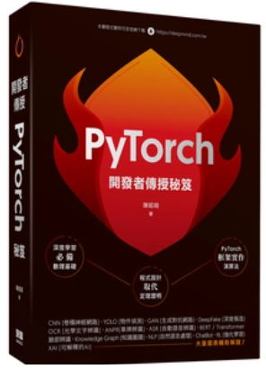

## 第15章	強化學習 Gym 套件v.2.6 大改版，現有程式會出現錯誤，請安裝 v2.4.1版
#### 請參閱 [v21 to v26 Migration Guide](https://gymnasium.farama.org/content/migration-guide/)
#### gym 不再更新，未來由 gymnasium 套件取代，請參閱 [Gymnasium GitHub](https://github.com/Farama-Foundation/Gymnasium)

# [PyTorch 開發者傳授秘訣](https://www.tenlong.com.tw/products/9786267146156?list_name=i-r-zh_tw)

## 目錄摘要：
##### 1. 第一章介紹AI 的發展趨勢，鑑古知今，瞭解前兩波AI 失敗的原因，比較第三波發展的差異性。
##### 2. 第二章介紹深度學習必備的統計/ 數學基礎，徹底理解神經網路求解的方法(梯度下降法) 與原理。
##### 3. 第三章介紹PyTorch 基礎功能，包括張量(Tensor) 運算、自動微分、神經層及神經網路模型。
##### 4. 第四章開始實作，依照機器學習10 項流程，以PyTorch 撰寫完整的範例，包括各式的損失函數、優化器、效能衡量指標。
##### 5. 第五章介紹PyTorch 進階功能，包括各種工具，如資料集(Dataset) 及資料載入器(DataLoader)、前置處理、TensorBoard 以及TorchServe 佈署工具，包括Web、桌面程式。
##### 6. 第六~ 十章介紹圖像/ 視訊的演算法及各式應用。
##### 7. 第十一~ 十四章介紹自然語言處理、語音及各式應用。
##### 8. 第十五章介紹AlphaGo 的基礎 -- 『強化學習』演算法。
##### 9. 第十六章介紹圖神經網路(Graph Neural Network, GNN)。

## 各章參考資料：參考資料.pdf
## 範例資料集：
https://drive.google.com/file/d/1czKLx3iOUx1KUPO8juPZeaV2-t2CPvh5/view?usp=sharing

## 如有疏漏或錯誤，請不吝指正。
